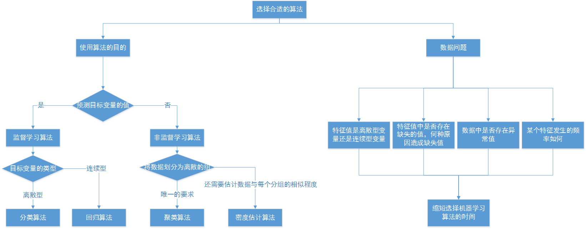

# 跟着《机器学习实践》的学习过程

书本对应的源代码可以在[这里](https://github.com/longyinzaitian/MLInActionCode)找到。

### kNN的近邻算法

- 优点：精度高、对异常值不敏感、无数据输入假定
- 缺点：计算复杂度高、空间复杂度高
- 适用数据范围：数值型和标称型 (标称型：就是离散型数据，变量的结果只在有限目标集中取值)

**k-近邻算法的一般流程**  

1. 收集数据
2. 准备数据：距离计算所需要的数值，最好是结构化的数据格式
3. 分析数据
4. 训练算法：本算法不需要此步骤
5. 测试算法：计算错误率
6. 使用算法：首先需要输入样本数据和结构化的输出结果，然后运行算法判定输入数据分别属于哪个分类，最后应用对计算出的分类执行后续的处理

k-近邻算法是基于实例的学习，必须有接近实际数据的训练样本数据。计算时必须保存全部数据集，可能会需要使用大量的存储空间。此外，因为必须对数据集中的每个数据计算距离值，实际使用可能非常耗时。另一个缺陷是，无法给出任何数据的基础结构信息，无法知晓平均实例样本和典型实例样本具有什么特征。

根据k-近邻算法的公式，某些数据偏差非常大的数据，会对结果千万非常大的影响。例如每年的飞行里程数，可以从0到几万，如果有这样的数据，在计算的时候，飞行里程对结果的影响非常严重。这种情况下，需要对数值进行归一化处理，也就是将取值范围处理为0~1，或者-1~1之间。可能使用以下公式将任意取值范围的特征值转化为 0 ~ 1 的区间。  
` newValue = (oldValue - min) / (max - min) `

### 决策树

- 优点：计算复杂度不高、输入结果易于理解、对中间值的缺失不敏感、可以处理不相关特征数据
- 缺点：可能会产生过度匹配(过度拟合，overfitting)问题
- 适用数据类型：数值型和标称型

**overfitting** 是这样一种现象：一个假设在训练数据上能够获得比其他假设更好的拟合，但是在训练数据外的数据集上却不能很好的拟合数据。此时我们就叫这个假设出现了overfitting 的现象。出现这种现象的主要原因是训练数据中存在噪音或者训练数据太少。而解决 overfitting 的方法主要有两种：提前停止树的增长或者对已经生成的树按照一定的规则进行后剪枝。

**决策树的一般流程**

1. 收集数据
2. 准备数据：树构造算法只适用于标称型数据，因此数据值数据必须离散化
3. 分析数据：可以使用任何方法，构造树完成之后，应该检查图形是否符合预期
4. 训练算法：构造树的数据结构
5. 测试算法：使用经验树计算错误率
6. 使用算法：此步骤可以适用于任何监督学习算法，而使用决策树可以更好地理解数据的内在含义

**递归构建决策树工作原理：**
得到原始数据集，然后基于最好的属性值划分数据集，由于特征值可能多于两个，因此可能存在大于两个分支的数据集划分。第一次划分之后，数据将被向下传递到树分支的下一个节点，在这个节点上，我们可以再次划分数据。因此我们可以采用递归的原则处理数据集。

**递归的结束条件是**  程序遍历完素有划分数据集的属性，或者每个分支下的所有实例都具有相同的分类。如果所有实例具有相同的分类，则得到一个叶子节点或者终止块。任何到达叶子节点的数据必然属于叶子节点的分类。

决策树分类器就像带有终止块的流程图，终止块表示分类结果。开始处理数据集时，我们首先需要测量集合中数据的不一致性，也不是熵，然后寻找最优方案划分数据集，直到数据集中的所有数据属于同一分类。ID3算法可以用于划分标称型数据集。通过采用递归的方法将数据转化为决策树。

### 基于概率论的朴素贝叶斯

- 优点：在数据较少的情况下仍然有效，可以处理多类别问题
- 缺点：对于输入数据的准备方式较为敏感
- 适用数据类型：标称型数据

**贝叶斯决策理论的核心思想，选择具有最高概率的决策。**

**朴素贝叶斯的一般流程**

1. 收集数据
2. 准备数据：需要数值型或者布尔型数据
3. 分析数据：有大量特征时，绘制特征作用不大，此时使用直方图效果更好
4. 训练算法：计算不同的独立特征的条件概率
5. 测试算法：计算错误率
6. 使用算法：一个常见的相互贝叶斯应用是文档分类。可以在任意的分类场景中使用朴素贝叶斯分类器，不一定非要是文本

